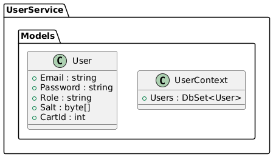

## eCommerceDsMicroServices_Docker

**eCommerceDsMicroServices_Docker** is a solution comprised of three ASP.NET Core Web API projects (microservices): CdService, ShoppingService, and UserService. It is the backend service layer for an e-commerce application, focused on record management. The Repository implements the data access logic. Services contains the application's business logic. Key features implemented in the project include: Authentication and Authorization, User Management (UserService), Catalog Management (CdService), Shopping Cart Management, and Order Management (ShoppingService).

**CdService** (Catalog Management) manages the catalog of records, music groups (Groups), and music genres (MusicGenres). It receives requests from ShoppingService to obtain information about records and update their stock.

**ShoppingService** (Shopping Cart and Order Management) manages shopping carts (Carts), cart details (CartDetails), and orders (Orders). It is a key consumer of CdService. When an item is added to the cart, ShoppingService calls CdService to obtain the item's details (such as price and current stock) before adding it. After adding or removing an item from the cart, ShoppingService calls CdService to update the item's stock. If a cart is disabled, ShoppingService returns the items to the available stock in CdService. ShoppingService interacts with UserService to obtain user information, such as their email address, to manage the carts and orders associated with them.

**UserService** (Authentication and Authorization, User Management) handles user management, including registration, login, password changes, and user validation. Authentication and authorization are provided using JWT. Upon successful registration of a new user, UserService calls ShoppingService to create a shopping cart associated with that user. The cart is created enabled by default for regular users and disabled for administrators. It receives requests from ShoppingService to validate the existence of users or retrieve user details.

All microservices are configured to use JWT for authentication and authorization, ensuring that calls between them and from the client are secure and that users have the appropriate roles to perform certain operations. Token propagation between services is handled by the AuthTokenPropagationHandler in ShoppingService.

## docker-compose
```cs
services:  
  cdservice:  
    build:  
      context: .  
      dockerfile: CdService/Dockerfile  
    depends_on:  
      - sqlserver  
  
  shoppingservice:  
    build:  
      context: .  
      dockerfile: ShoppingService/Dockerfile  
    depends_on:  
      - cdservice  
      - userservice  
      - sqlserver  
  
  userservice:  
    build:  
      context: . 
      dockerfile: UserService/Dockerfile  
    depends_on:  
      - sqlserver  
  
  sqlserver:  
    image: mcr.microsoft.com/mssql/server:2022-latest  
  
volumes:  
  sql_data:  
``` 


CdService/  
├── AutoMappers/  
│   └── MappingProfile.cs  
├── Controllers/  
│   ├── GroupsController.cs  
│   ├── MusicGenresController.cs  
│   └── RecordsController.cs  
├── DTOs/  
│   ├── GroupDTO.cs  
│   ├── GroupInsertDTO.cs  
│   ├── GroupItemDTO.cs  
│   ├── GroupRecordsDTO.cs  
│   ├── GroupUpdateDTO.cs  
│   ├── MusicGenreDTO.cs  
│   ├── MusicGenreInsertDTO.cs  
│   ├── MusicGenreItemDTO.cs  
│   ├── MusicGenreTotalGroupsDTO.cs  
│   ├── MusicGenreUpdateDTO.cs  
│   ├── RecordDTO.cs  
│   ├── RecordInsertDTO.cs  
│   ├── RecordItemDTO.cs  
│   ├── RecordItemExtDTO.cs  
│   └── RecordUpdateDTO.cs  
├── Models/  
│   ├── CdContext.cs  
│   ├── Group.cs  
│   ├── MusicGenre.cs  
│   └── Record.cs  
├── Repository/  
│   ├── GroupRepository.cs  
│   ├── IeCommerceDsRepository.cs  
│   ├── IGroupRepository.cs  
│   ├── IMusicGenreRepository.cs  
│   ├── IRecordRepository.cs  
│   ├── MusicGenreRepository.cs  
│   └── RecordRepository.cs  
├── Services/  
│   ├── FileManagerService.cs  
│   ├── GroupService.cs  
│   ├── IeCommerceDsService.cs  
│   ├── IFileManagerService.cs  
│   ├── IGroupService.cs  
│   ├── IMusicGenreService.cs  
│   ├── IRecordService.cs  
│   ├── MusicGenreService.cs  
│   └── RecordService.cs  
├── Validators/  
│   ├── FileTypeValidator.cs  
│   ├── GroupFileType.cs  
│   ├── GroupInsertValidator.cs  
│   ├── GroupUpdateValidator.cs  
│   ├── MusicGenreInsertValidator.cs  
│   ├── MusicGenreUpdateValidator.cs  
│   ├── RecordInsertValidator.cs  
│   ├── RecordUpdateValidator.cs  
│   └── WeightFileValidator.cs  
├── appsettings.json  
├── Dockerfile    
└── Program.cs  


## Program
```cs
builder.Services.AddDbContext<CdContext>(options =>
{
    options.UseSqlServer(builder.Configuration.GetConnectionString("CdDBConnection"),
        sqlServerOptionsAction: sqlOptions =>
        {
            sqlOptions.EnableRetryOnFailure(
                maxRetryCount: 5,
                maxRetryDelay: TimeSpan.FromSeconds(30),
                errorNumbersToAdd: null);
        });
    options.UseQueryTrackingBehavior(QueryTrackingBehavior.TrackAll);
});
``` 

## appsetting.json
```cs
{
  "ConnectionStrings": {
        "CdDBConnection": "Server=sqlserver;Database=CdDB;User=sa;Password=YourStrong!Password;TrustServerCertificate=True;MultipleActiveResultSets=True"  
}
``` 


ShoppingService/  
├── AutoMappers/  
│   └── MappingProfile.cs  
├── Controllers/  
│   ├── CartDetailsController.cs  
│   ├── CartsController.cs  
│   └── OrdersController.cs  
├── DTOs/  
│   ├── CartDetailDTO.cs  
│   ├── CartDetailInfoDTO.cs  
│   ├── CartDTO.cs  
│   ├── CartStatusDTO.cs  
│   ├── OrderDetailDTO.cs  
│   ├── OrderDTO.cs  
│   ├── RecordDTO.cs  
│   ├── UpdateStockDTO.cs  
│   └── UserDTO.cs  
├── Handlers/  
│   └── AuthTokenPropagationHandler.cs  
├── Models/  
│   ├── Cart.cs  
│   ├── CartDetail.cs  
│   ├── ShoppingContext.cs  
│   ├── Order.cs  
│   └── OrderDetail.cs  
├── Repository/  
│   ├── CartDetailRepository.cs  
│   ├── CartRepository.cs  
│   ├── ICartDetailRepository.cs  
│   ├── ICartRepository.cs  
│   ├── IOrderRepository.cs  
│   └── OrderRepository.cs  
├── Services/  
│   ├── CartDetailService.cs  
│   ├── CartService.cs  
│   ├── ICartDetailService.cs  
│   ├── ICartService.cs  
│   ├── IOrderService.cs  
│   ├── IRecordService.cs  
│   ├── IUserService.cs  
│   ├── OrderService.cs  
│   ├── RecordService.cs  
│   └── UserService.cs  
├── appsettings.json  
├── Dockerfile  
└── Program.cs  


## Program
```cs
builder.Services.AddDbContext<ShoppingContext>(options =>
{
    options.UseSqlServer(builder.Configuration.GetConnectionString("ShoppingDBConnection"),
        sqlServerOptionsAction: sqlOptions =>
        {
            sqlOptions.EnableRetryOnFailure(
                maxRetryCount: 5,
                maxRetryDelay: TimeSpan.FromSeconds(30),
                errorNumbersToAdd: null);
        });
    options.UseQueryTrackingBehavior(QueryTrackingBehavior.TrackAll);
    options.EnableSensitiveDataLogging();
    options.EnableDetailedErrors();
});
``` 

## appsetting.json
```cs
{
  "ConnectionStrings": {
    "ShoppingDBConnection": "Server=sqlserver;Database=ShoppingDB;User=sa;Password=YourStrong!Password;TrustServerCertificate=True;MultipleActiveResultSets=True"  
}
``` 




UserService/  
├── AutoMappers/  
│   └── MappingProfile.cs  
├── Classes/  
│   └── HashResult.cs  
├── Controllers/  
│   ├── AuthController.cs  
│   └── UsersController.cs  
├── DTOs/  
│   ├── CartDTO.cs  
│   ├── ChangePasswordDTO.cs  
│   ├── LoginResponseDTO.cs  
│   ├── UserDTO.cs  
│   ├── UserInsertDTO.cs  
│   └── UserLoginDTO.cs  
├── Models/  
│   ├── User.cs  
│   └── UserContext.cs  
├── Repository/  
│   ├── IUserRepository.cs  
│   └── UserRepository.cs  
├── Services/  
│   ├── CartService.cs  
│   ├── HashService.cs  
│   ├── ICartService.cs  
│   ├── ITokenService.cs  
│   ├── IUserService.cs  
│   ├── TokenService.cs  
│   └── UserService.cs  
├── appsettings.json  
├── Dockerfile  
└── Program.cs  


## Program
```cs
builder.Services.AddDbContext<UserContext>(options =>
{
    options.UseSqlServer(builder.Configuration.GetConnectionString("UserDBConnection"),
        sqlServerOptionsAction: sqlOptions =>
        {
            sqlOptions.EnableRetryOnFailure(
                maxRetryCount: 5,
                maxRetryDelay: TimeSpan.FromSeconds(30),
                errorNumbersToAdd: null);
        });
    options.UseQueryTrackingBehavior(QueryTrackingBehavior.TrackAll);
});
``` 

## appsetting.json
```cs
{
  "ConnectionStrings": {
    "UserDBConnection": "Server=sqlserver;Database=UserDB;User=sa;Password=YourStrong!Password;TrustServerCertificate=True;MultipleActiveResultSets=True"  
}
``` 


[DeepWiki moraisLuismNet/eCommerceDsMicroServices_Docker](https://deepwiki.com/moraisLuismNet/eCommerceDsMicroServices_Docker)